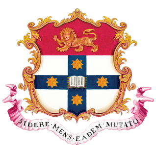

 

    
    <h3 align="center">Experiments in preprocessing techniques for underwater acoustic target recognition</h3>
    

        Official repository for my undergraduate thesis
         
        Supervised by Daniel La Mela (Thales) and Dr. Dong Yuan (USYD)
         
        <a href="">Dissertation</a>
        ·
        <a href="">Presentation</a>
    

_Underwater acoustic target recognition (UATR) is a critical task in the application of sonar systems that aims to classify objects based on their acoustic signatures. Traditionally, UATR has relied on rule-based systems and the expertise of highly-trained sonar technicians to extract and classify features from raw sonar signals. However, recent advancements in artificial intelligence, particularly the rise of deep learning, have spurred interest in automating this process._

_A key factor influencing classification accuracy in machine learning models is the quality of the input data. To this end, various preprocessing techniques have been developed to enhance sonar signal quality by reducing noise and highlighting relevant features. This thesis evaluates the impact of three preprocessing techniques -- normalisation, detrending, and denoising -- on UATR performance, using the DeepShip dataset and a hybrid convolutional neural network-long short-term memory (CNN-LSTM) model as the experimental foundation._

_Experiments with normalisation revealed minimal impact, largely due to the inherent consistency of the dataset and prior preprocessing steps, such as power spectrogram conversion. Detrending with $\ell_1$ algorithms consistently reduced classification accuracy, likely due to over-smoothing and disruption of spectrogram features critical for the CNN-LSTM model. Efforts to adapt the Noise2Noise framework for denoising underwater spectrograms highlighted the challenges of dynamic underwater environments, where its assumptions could not be effectively met. Despite these limitations, masking-based denoising techniques showed promise in isolating regions of interest in spectrograms, offering a viable direction for future exploration._

_This thesis underscores the unique challenges of adapting machine learning techniques to the underwater acoustic domain. The findings highlight the need for tailored preprocessing and model development to address the inherent variability and complexity of sonar data, paving the way for more robust and effective UATR systems._